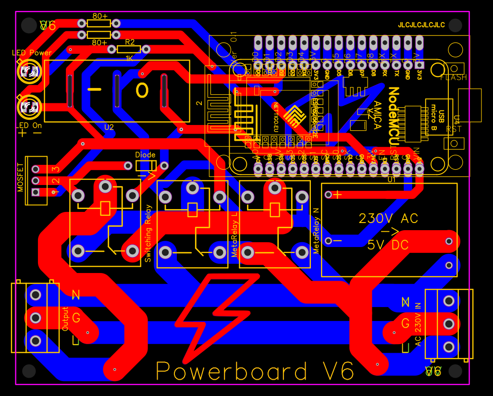

# Arduino board power driver

This repo contains the code for an arduino board driving a power switch. It works by creating a (sort of) websocket connection with a server and listening for changes in a certain key (identifying this board). If something changes, a pin's output value is changed. This pin is hooked up to a relay, which will pass through regular 230V power to the to-power device.

This project uses [PlatformIO](https://platformio.org/) for simple uploading and interfacing with the board itself.

This project is part of the larger [home-automation](https://github.com/SanderRonde/home-automation) project, where this is part of the keyval module.

## PCB

PCB source file (in format of [EasyEda](https://easyeda.com)) can be found at `pcb/pcb-easyeda.json`.

Most components speak for themselves and are listed on the PDB, notable ones:
- it takes an ESP8266 devkit board (can be either the wide or narrower one)
- it requires a 230V AC to 5V DC converter




## License

```text
Copyright 2019 Sander Ronde

Permission is hereby granted, free of charge, to any person obtaining a copy of this software and associated documentation files (the "Software"), to deal in the Software without restriction, including without limitation the rights to use, copy, modify, merge, publish, distribute, sublicense, and/or sell copies of the Software, and to permit persons to whom the Software is furnished to do so, subject to the following conditions:

The above copyright notice and this permission notice shall be included in all copies or substantial portions of the Software.

THE SOFTWARE IS PROVIDED "AS IS", WITHOUT WARRANTY OF ANY KIND, EXPRESS OR IMPLIED, INCLUDING BUT NOT LIMITED TO THE WARRANTIES OF MERCHANTABILITY, FITNESS FOR A PARTICULAR PURPOSE AND NONINFRINGEMENT. IN NO EVENT SHALL THE AUTHORS OR COPYRIGHT HOLDERS BE LIABLE FOR ANY CLAIM, DAMAGES OR OTHER LIABILITY, WHETHER IN AN ACTION OF CONTRACT, TORT OR OTHERWISE, ARISING FROM, OUT OF OR IN CONNECTION WITH THE SOFTWARE OR THE USE OR OTHER DEALINGS IN THE SOFTWARE.
```